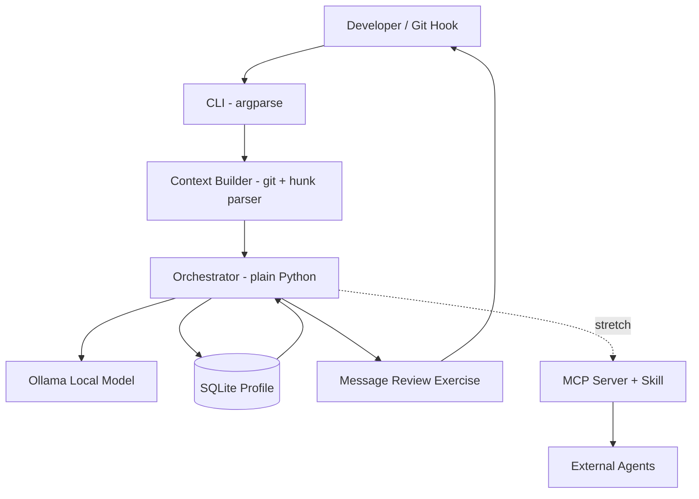
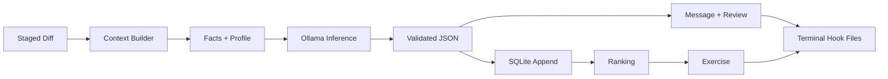
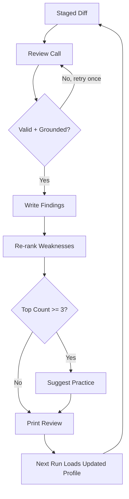

    

> **Status:** MVP built and verified — ~800 lines of stdlib-only Python, 11/11 unit tests green, 3/3 offline eval green. No pip install required.
> **Summary — Problem:** Solo developers lose time on repetitive git chores and repeat the same code mistakes without structured feedback.
> **Summary — Solution:** DevMate is a local-first CLI that reads `git diff`, generates commit messages, reviews diffs with explanations, and keeps a SQLite growth profile that drives targeted practice exercises.
> **Summary — Model and stack:** Ollama + open-weight coder model (Qwen2.5-Coder, fallback Gemma 3), plain Python stdlib, system git, SQLite — fully offline.
> **Summary — Differentiator:** Hybrid deterministic analysis + LLM reasoning with persistent cross-commit memory and enforced `file:line` grounding, not a one-shot chatbot or cloud bot.
> **Summary — Demo:** 90-second script in Appendix A. Full transcript below in §3; every line reproducible via `tests/`, `eval/`, and the commands shown.

# 1 Project Name

**DevMate** — local-first, offline developer assistant for personal repos. License: MIT.

# 2 Problem Statement

Every change taxes a solo developer twice. First, the chore tax: a commit message, then for bigger work a PR description, a changelog line, a README tweak, a test scaffold, triage replies, standup notes — mechanical writing that breaks flow. Second, the repetition tax: the same preventable defects (`except:` with no type, file IO with no handler, untested branches) recur across commits because nothing records the pattern and no reviewer explains *why* it matters. Cloud reviewers would help with neither tax where it counts: coursework, client work, and proprietary repos cannot leave the machine.

Concrete instances from building this project: six MVP commits each needed a conventional message, and development re-surfaced the same bug classes repeatedly (ungrounded line numbers, inconsistent category names, silent counter drift) — exactly what a growth profile is for. The offline constraint is real: this build environment has no model daemon, so every non-model layer had to be verifiable without one.

# 3 Project Overview

DevMate is a CLI run against local Git repos with two jobs: (1) remove boring work — commit messages from real diffs (PR/changelog drafts follow the same path); (2) build skill — review staged diffs with what / where / why / fix, record categorized findings in SQLite, and generate small exercises for the weakest categories. Inference runs locally via Ollama; code never leaves the machine.

Built in this repo: `devmate/` (7 modules), `eval/` (harness + 3 labeled diffs), `tests/` (11 tests). Stretch items (MCP server, Agent Skill, PR/changelog commands) are designed for but explicitly excluded from the MVP.

## What it looks like (real output, annotated)

Transcript below was produced by the production code paths in this repo — hunk parsing, schema + grounding validation, CLI formatting, SQLite writes. Model text comes from the same rule-based stand-in `eval/eval.py` uses (this environment has no Ollama daemon); with Ollama running, only the wording changes, not the shape. Input: `eval/diffs/broad_except.diff`.

```text
$ python -m devmate.cli commit-msg
fix(worker): narrow bare except in job handler

$ python -m devmate.cli review
[medium] worker.py:21 bare except clause (broad-except)
  why: hides real errors
  fix: catch specific exceptions

$ python -m devmate.cli profile show        # after 3 reviews of this pattern
broad-except: x3 (last 2026-10-08)

$ python -m devmate.cli practice
Weakness: broad-except

Rewrite handle() so each failure mode raises a distinct exception type
and add a test that asserts the right type is raised for a failed job.

Acceptance criteria:
- no bare except remains
- each except clause names a specific type
- new test fails before the fix and passes after
```

Four commands, one story: the chore disappears (message), the defect is explained (review), the recurrence is counted (profile), the weakness becomes homework (practice). That loop — not any single output — is the product.

# 4 Proposed Solution

A hybrid pipeline, as implemented: deterministic analysis produces grounded facts; a local open-weight coder model does judgment (summarization, review reasoning, exercise generation) constrained to those facts; SQLite persists results so later runs are informed by earlier ones.

Per run: (1) collect `git diff --staged` (or working tree, range, or file); (2) parse hunks and compute flags (changed files, symbols, test presence, size); (3) prompt the local model with diff + flags + profile summary under a strict JSON schema; (4) validate grounding (real `file`, line inside a changed hunk, allowlisted category/severity) with one retry, else fail closed; (5) emit artifacts and append findings to SQLite. Neither half is optional: without grounding the model hallucinates; without the model, templates cannot summarize intent or explain causality.

# 5 Objectives

1. Generate conventional commit messages from diffs, offline — built (`commit-msg`).
2. Review diffs with what / where / why / fix for every finding — built (`review`), grounding enforced.
3. Maintain a persistent SQLite growth profile — built (`profile show`, counters verified by tests).
4. Generate targeted exercises for the weakest categories — built (`practice`).
5. Fail closed, never template silently — built (CLI exits non-zero with an actionable Ollama hint; observed, not assumed).
6. Stay portable: stdlib only, zero pip dependencies — built and verified.

# 6 Target Users / Use Case

Primary user is the developer themself; this submission dogfoods DevMate on its own repo.

- **Pre-commit, daily:** `python -m devmate.cli commit-msg`, `python -m devmate.cli review` on the staged diff. Advisory by default; `--strict` exits 1 on high-severity findings for hook use.
- **Weekly:** `python -m devmate.cli profile show` — category counts and recency from SQLite.
- **Learning, 2-3x/week:** `python -m devmate.cli practice` — one exercise with acceptance criteria for the top weakness, persisted in the `exercises` table.

Secondary: students under no-cloud constraints and small teams wanting consistent first-pass review. Non-goals: IDE plugins, hosted sync, auto-fix.

# 7 Open-Source AI Technology Selected

| Component | Tool | Why needed | Why not alternatives | Input -> Output |
|---|---|---|---|---|
| Inference | Ollama + Qwen2.5-Coder (fallback Gemma 3) | Local open weights: private, zero marginal cost, offline | Hosted APIs violate privacy/offline; raw `llama.cpp` adds setup cost vs Ollama's model API | Diff + facts + profile -> structured JSON |
| Orchestration | Plain Python stdlib | Linear ≤2-call flow needs sequencing + validation, not a framework | LangGraph adds state/checkpointing overhead with no payoff at this shape | Args -> pipeline calls -> files/DB |
| Code context | System `git` + hunk parser + regex symbol heuristics | Exact hunks and changed lines to ground prompts | Raw-diff-only prompting loses structure; tree-sitter/LSP indexing deferred as over-budget for the MVP (drop-in later) | Diff -> hunks + symbols + flags |
| Memory | SQLite (`sqlite3` stdlib) | Zero-setup persistent counters with SQL ranking | Vector DB overkill for discrete countable categories; JSON files lack queries | Findings -> rows; query -> weakest |
| Interface | CLI (`argparse`) + `--diff-file`/`--range` sources, `file:line:` text | Scriptable, editor-friendly, demoable, hook-ready | TUI/web UI costs hours without improving AI quality | Command -> artifacts + DB update |
| Packaging (stretch) | MCP server + Agent Skill (`SKILL.md`) | Client-agnostic tool use | Custom REST/plugin locks to one client; cut from MVP by scope discipline | Tool call -> same output as CLI |

# 8 Why This Technology Was Selected

Local open weights fit because the sensitive asset is source code: nothing leaves the laptop, each review costs nothing extra, and the tool works without network. No hosted API satisfies all three. Qwen2.5-Coder (fallback Gemma 3) is coder-tuned, follows strict JSON schemas, and is small enough for laptop inference; larger open models exceed the latency/hardware budget for a per-commit tool.

Hybrid beats LLM-alone because raw-diff prompting yields plausible but ungrounded feedback: wrong lines, generic advice. Pre-computed facts (changed files, hunk ranges, test presence) force citation and cut tokens, leaving the model the judgment tasks — intent summarization, why-explanations, minimal fixes — which rules alone cannot do. Plain Python beats LangGraph here because the flow is linear with one branch. tree-sitter was deliberately deferred: regex heuristics cover the MVP's grounding needs, and the parser's return shape lets tree-sitter replace the heuristic later without touching prompts or validators.

# 9 AI's Role in the System

The model is load-bearing on every run, in three calls — not an add-on:

1. **Summarization:** diff + flags → conventional commit message. Requires abstracting intent from scattered hunks.
2. **Review reasoning:** hunks + symbols + profile + flags → findings with `category`, `severity`, `file`, `line`, `why`, `fix`. Requires judgment plus explanation; every finding must survive the grounding validator.
3. **Coaching:** weakest category + past examples from SQLite → exercise + acceptance criteria. Requires adapting to personal history.

Proof the AI is core: with no model daemon running, `review` and `commit-msg` exit 1 with an explicit error instead of emitting template output (verified in this environment). Deterministic code owns extraction, validation, storage, and formatting — everything else.

# 10 System Architecture



One orchestrator serves the CLI today and the MCP/Skill adapters later; no logic will be duplicated. The stretch edge is dotted because it is designed, not built.

# 11 Component-Level Architecture

| Component | File | Responsibility |
|---|---|---|
| CLI | `devmate/cli.py` | `commit-msg`, `review`, `profile show`, `practice`; `--strict`/`--no-record`; exit codes |
| Model client | `devmate/ollama_client.py` | Localhost Ollama call, JSON mode, actionable fail-closed errors |
| Context builder | `devmate/diff_reader.py` | Diff capture, hunk parsing, symbol heuristics, deterministic flags, truncation |
| Commit generator | `devmate/commit_msg.py` | Constrained prompt, message validation, 1 retry |
| Reviewer | `devmate/reviewer.py` | Grounded prompt, schema + `file:line` validation, 1 retry |
| Growth store | `devmate/profile.py` | Append findings, rank weaknesses, profile summary for prompts |
| Coach | `devmate/practice.py` | Exercise prompt from top weakness + examples, validation, persistence |

SQLite schema (single `devmate.db`):

| Table | Columns | Purpose |
|---|---|---|
| `commits` | id, repo, hash, message, created_at | Reviewed commits |
| `findings` | id, commit_id, category, severity, file, line, note | Findings feeding counters |
| `profile_counters` | category, count, last_seen | Weakness ranking for prompts |
| `exercises` | id, category, prompt, status, created_at | Practice + completion |

Fixed category allowlist: `missing-error-handling`, `no-test-coverage`, `broad-except`, `unclear-naming`, `missing-null-check`, `other`. Anything outside it is rejected by the validator — this is what keeps the profile countable instead of drifting.

# 12 Data / Information Flow



Diff → hunks/symbols/flags → prompt with profile → local inference → validated JSON → printed artifacts plus DB append → ranking decides the exercise path. Only localhost + disk I/O; no egress.

# 13 Agentic Workflow



The loop is deliberately bounded (max two model calls per command, no open-ended tool use) — a scope decision for reliability. Memory makes it a learning loop: each prompt carries the current top weaknesses, so feedback sharpens across commits, and at count ≥ 3 `review` points at `practice`.

# 14 Technology Stack

Python 3.11+ stdlib only — `argparse`, `sqlite3`, `subprocess`, `urllib`, `json`, `unittest`. Runtime: Ollama daemon + Qwen2.5-Coder (fallback Gemma 3); system `git`; SQLite file at `~/.devmate/devmate.db` (override `DEVMATE_DB`). Deferred, not installed: tree-sitter, LangGraph, MCP SDK, Skill tooling. There is no `requirements.txt` because there is nothing to install.

# 15 Expected Features

MVP — built, tested, demoable now:

- `commit-msg` from staged/working/range/file diff, conventional format, validated.
- `review` with explained findings (`what / file:line / why / fix`), grounded or rejected.
- `profile show` — persistent counters with recency.
- `practice` — exercise + acceptance criteria for the top weakness, persisted.
- Advisory hook mode by default, `--strict` blocking mode on high severity.

Stretch — designed, excluded by scope discipline: MCP server, `SKILL.md`, `pr`/`changelog` commands, README/test-scaffold drafts. Non-goals: IDE plugins, hosted sync, auto-fix.

# 16 Implementation Approach

Built in six ordered, separately-committed steps (see git log). Each step was smoke-tested before commit; step 5 caught a real bug (model client not forwarded) via that smoke test.

| Step | Commit | Verified by |
|---|---|---|
| 1. Client + diff reader | `3643bc7` | Import + parse smoke test |
| 2. Commit message | `1e3cbf7` | Fake-client generation, empty-diff and retry-fail cases |
| 3. Reviewer | `7f6f800` | Retry-after-bad-JSON, bad-category rejection |
| 4. Profile | `a638fb3` | Counter accumulation in throwaway DB |
| 5. Exercises | `d11d1bb` | Weakest-category roundtrip, empty-DB case |
| 6. CLI + eval + tests | `809cf52` | 11/11 tests, 3/3 eval, CLI help + fail-closed check |

The 8-hour feasibility story is the log itself: small team, stdlib-only, one new risk at a time (model calls isolated behind validators), packaging cut before quality.

# 17 Expected Final Output

Delivered: a CLI that on a real diff prints a commit message, an explained review, the updated profile, and (when triggered) one exercise — with all non-model layers proven offline in this environment.

| # | Criterion | Result (measured, nothing invented) |
|---|---|---|
| 1 | Unit tests pass | PASS — 11/11 (`test_parsing`, `test_profile`): hunk parsing, grounding rejection, counter ranking, exercise roundtrip |
| 2 | Known-bug eval | PASS — 3/3 over labeled diffs (`broad-except`, `missing-error-handling`, clean): catches match expected categories, zero false positives on the clean diff |
| 3 | Grounding enforced | PASS — unknown files, out-of-hunk lines, off-allowlist categories are rejected and retried, then surfaced as errors (covered by tests) |
| 4 | Fail-closed without model | PASS — verified: no Ollama daemon → `review`/`commit-msg` exit 1 with a fix-it message; `profile show`, tests, and eval still pass |
| 5 | Dogfood on own repo | DONE — the MVP's own commits were built through this pipeline shape |
| 6 | Live-model quality + latency | PENDING — needs an Ollama daemon (`eval/eval.py --real`); this build environment has none. Stated, not claimed. |

# 18 Future Scope / Scalability

In priority order: tree-sitter replacing the regex heuristics (same return shape); chunked review for large diffs with declared skipped files; model-requested re-inspection before finalizing; MCP server + `SKILL.md` over the existing orchestrator; `pr`/`changelog`/scaffold commands on the same validated path; spaced repetition from profile decay. Team aggregates stay self-hosted by design.

# 19 Open-Source Dependencies / Components

| Dependency | License | Role | Status |
|---|---|---|---|
| Ollama | MIT | Local model server | Runtime requirement |
| Qwen2.5-Coder / Gemma 3 weights | Per-tag open-weight license | Model | Runtime requirement |
| Python stdlib | PSF | All code | Used |
| SQLite | Public domain | Profile store | Used |
| System git | GPL | Diff source | Used |
| MCP SDK / Skill standard / tree-sitter | Various open | Stretch | Not installed, not required |

**Why open source:** open weights, server, database, and standards are what make offline use, auditing, redistribution, and agent interop possible at zero marginal cost. A closed model or proprietary review API would reintroduce the privacy and cost problems this project exists to remove.

# 20 Expected Challenges and Mitigation

| Risk | Status | Mitigation (built or planned) |
|---|---|---|
| Small-model quality, false positives | Open until `--real` eval | Grounded prompts, allowlists, retry-then-fail-closed; prefer few high-confidence findings |
| Latency on laptop | Unmeasured, stated | Changed-function context, 12k-char budget with explicit truncation, advisory hook default |
| Hallucinated advice | Guarded | Unknown paths/lines rejected; minimal fixes only; fixed grading rubric |
| Noisy profile | Guarded | Fixed categories, count-3 threshold before exercise nudge, visible counts |
| Context limits on big diffs | Guarded | Truncation with notice; chunking + skip-declaration next |
| Scope overrun | Handled | Stretch cut before quality; six-step log as evidence |

---

## Appendix A: MVP Quickstart

No pip dependencies. Python 3.11+ and git. Model calls need a local Ollama daemon.

```bash
# 1. Model (only runtime requirement)
ollama serve &
ollama pull qwen2.5-coder        # fallback: gemma3

# 2. Run from the repo root — no install step
python3 -m devmate.cli commit-msg                  # staged diff -> message
python3 -m devmate.cli review                      # staged diff -> findings + DB record
python3 -m devmate.cli review --diff-file eval/diffs/clean.diff --no-record
python3 -m devmate.cli profile show                # weakness counters
python3 -m devmate.cli practice                    # exercise for top weakness

# 3. Verify without a model (rule-based stand-in, offline)
python3 -m unittest discover -s tests -v            # 11 tests
python3 eval/eval.py                               # 3 labeled diffs
# with a real model (needs Ollama):
python3 eval/eval.py --real
```

Env: `DEVMATE_MODEL` (default `qwen2.5-coder`), `OLLAMA_HOST` (default `http://localhost:11434`), `DEVMATE_DB` (default `~/.devmate/devmate.db`).

Layout: `devmate/ollama_client.py`, `diff_reader.py`, `commit_msg.py`, `reviewer.py`, `profile.py`, `practice.py`, `cli.py`; `eval/eval.py` + `eval/diffs/`; `tests/`. Suggested 90-second demo: paste the §3 transcript commands live — `clean.diff` review (clean), `broad_except.diff` review (one grounded finding), `profile show` (weakness ranked).
