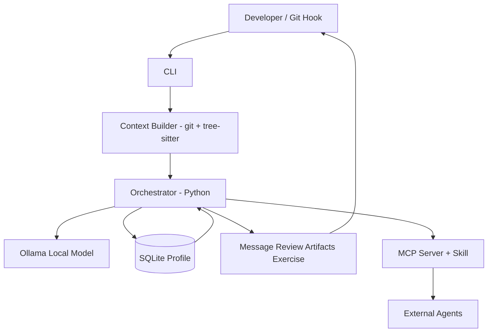
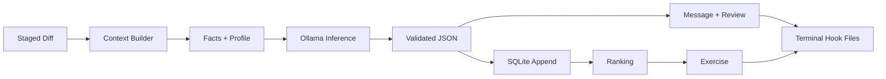
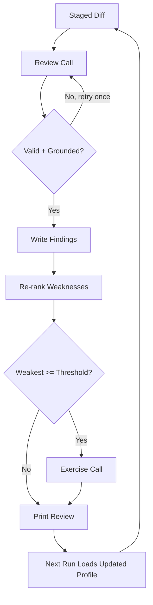

> **Summary — Problem:** Solo developers lose time on repetitive git chores and repeat the same code mistakes without structured feedback.
> **Summary — Solution:** DevMate is a local-first CLI that reads `git diff` + code structure, generates commit artifacts, reviews diffs with explanations, and keeps a SQLite growth profile that drives practice exercises.
> **Summary — Model and stack:** Ollama + open-weight coder model, plain Python, tree-sitter, SQLite, MCP server + Agent Skill, all offline.
> **Summary — Differentiator:** Hybrid deterministic analysis + LLM reasoning with persistent cross-commit memory, not a one-shot chatbot or cloud bot.
> **Summary — Final-day deliverable:** Offline CLI demoed on its own repo: commit message + explained review + profile update + one exercise.

# 1 Project Name

**DevMate** (working name) — local-first, offline developer assistant for personal repos.

[TODO: Confirm final team name, repo name, member names + roles.]

# 2 Problem Statement

Solo developers pay the same tax on every change: commit messages, PR descriptions, changelogs, README updates, test scaffolding, issue triage, standup notes. Separately, without a senior reviewer, the same preventable defects recur across commits because nothing tracks the pattern or explains *why* it matters. Cloud reviewers exist but require sending code off-machine, which blocks coursework, client, and proprietary repos.

My concrete instances (fill from real history so the proposal reads as observed, not generic):

[TODO: List 4-6 real boring tasks, e.g. "commit messages for small refactors in repo X", "CHANGELOG/README updates", "pytest scaffolding", "duplicate issue triage", "standup notes from git log".]
[TODO: List 3-5 repeated mistakes you actually make, e.g. "missing error handling on file/network calls", "missing null checks", "untested branches", "broad try/except", "inefficient loops". These become the profile categories in Sections 11/17.]
[TODO: Note 1-2 cases where sending code to a cloud service was blocked or undesirable.]

# 3 Project Overview

DevMate is a CLI run against local Git repos with two jobs: (1) remove boring work — commit messages, PR/changelog drafts, README patches, test scaffolds, triage drafts, standup notes from real diffs; (2) build skill — review staged diffs with explanations, record categorized findings in SQLite, and generate small exercises for the weakest categories. Inference runs locally via Ollama; code never leaves the machine. A Git hook, MCP server, and Agent Skill (`SKILL.md`) expose the same capability to terminals, hooks, and other agents.

# 4 Proposed Solution

A hybrid pipeline: deterministic analysis (Git + tree-sitter) produces grounded facts; a local open-weight coder model does judgment (summarization, review reasoning, exercise generation) constrained to those facts; SQLite persists results so later runs are informed by earlier ones.

Per run: (1) collect `git diff --staged`, file stats, tree-sitter symbols; (2) compute deterministic flags (changed functions, missing tests, size, secrets patterns); (3) prompt the local model with diff + facts + profile summary under a strict JSON schema; (4) validate grounding (real `file:line`, allowed categories); (5) emit artifacts and append findings to SQLite. Neither half is optional: without grounding the model hallucinates; without the model, templates cannot summarize intent or explain causality.

# 5 Objectives

1. Generate conventional commit messages and PR/changelog drafts from diffs, offline.
2. Review diffs with what / where / why / fix for every finding.
3. Maintain a persistent SQLite growth profile from commits and review feedback.
4. Generate targeted exercises for the weakest categories.
5. Stay within laptop latency for typical diffs.
6. Expose review, commit-msg, and practice as MCP tools and an Agent Skill.

# 6 Target Users / Use Case

Primary user is the developer themself; the qualifier demo dogfoods DevMate on its own repo.

- **Pre-commit, daily:** `devmate commit-msg`, `devmate review --staged` on the staged diff. Output in seconds, in-terminal or via hook.
- **Weekly:** `devmate standup`, `devmate profile show` from commit history + SQLite trends.
- **Learning, 2-3x/week:** `devmate practice --weakest` → one exercise with acceptance criteria, then a graded attempt.

Secondary: students under no-cloud constraints, small teams wanting consistent first-pass review. Non-goals for the day: team dashboards, hosted sync, IDE extensions.

# 7 Open-Source AI Technology Selected

| Component | Tool | Why needed | Why not alternatives | Input -> Output |
|---|---|---|---|---|
| Inference | Ollama + open-weight coder (Qwen2.5-Coder; fallback Gemma 3) [VERIFY: exact Ollama tag/size on build day] | Local open weights: private, zero marginal cost, offline | Hosted APIs violate privacy/offline; raw `llama.cpp` adds setup cost vs Ollama's model API | Diff + facts + profile -> structured JSON |
| Orchestration | Plain Python stdlib | Linear 2-call MVP needs sequencing + validation, not a framework | LangGraph adds state/checkpointing overhead; adopt only for agentic stretch | Args -> pipeline calls -> files/DB |
| Code context | `git` CLI + tree-sitter | Exact hunks, symbols, changed functions to ground prompts | Raw-diff-only prompting loses structure, wastes tokens; full LSP index too heavy for 8h | Diff -> hunks + symbols + flags |
| Memory | SQLite (`sqlite3` stdlib) | Zero-setup persistent counters with SQL ranking | Vector DB overkill for discrete countable categories; JSON files lack queries | Findings -> rows; query -> weakest |
| Packaging | MCP server (Python MCP SDK) + Skill (`SKILL.md`, agentskills.io) [VERIFY: SDK + spec versions] | Client-agnostic tool use by any MCP/skill harness | Custom REST/plugin locks to one client | Tool call -> same output as CLI |
| Interface | CLI (`argparse`) + Git hook, `file:line:` text | Scriptable, editor-friendly, demoable | TUI/web UI costs hours without improving AI quality | Command -> artifacts + DB update |

# 8 Why This Technology Was Selected

Local open weights fit because the sensitive asset is source code: nothing leaves the laptop, each review costs nothing extra, and the tool works without network. No hosted API satisfies all three. Qwen2.5-Coder (fallback Gemma 3) is coder-tuned, schema-following, and small enough for laptop inference; larger open models exceed the latency/hardware budget. [VERIFY: parameter size that runs acceptably on demo hardware, and exact weight license per tag.]

Hybrid beats LLM-alone because raw-diff prompting yields plausible but ungrounded feedback: wrong lines, generic advice. Pre-computed facts (changed functions, test presence, line ranges) force citation and cut tokens, leaving the model the judgment tasks — intent summarization, why-explanations, minimal fixes — which rules alone cannot do. Plain Python beats LangGraph for the MVP because the path is linear with one branch; LangGraph is reserved for the stretch loop where the model requests re-inspection.

# 9 AI's Role in the System

The model is load-bearing on every run, in three calls:

1. **Summarization:** diff + history style + facts → commit message, PR body, changelog lines. Requires abstracting intent from hunks.
2. **Review reasoning:** hunks + symbols + profile + flags → findings with `category`, `severity`, `file:line`, `why`, `fix`. Requires judgment plus explanation.
3. **Coaching:** weakest category + past examples → exercise + criteria, then pass/fail grading. Requires adaptation to personal history.

Deterministic code does extraction, chunking, validation, storage, formatting. If the model is down, the CLI errors rather than emitting template output.

# 10 System Architecture



One orchestrator serves CLI and (stretch) MCP/Skill adapters; no logic is duplicated.

# 11 Component-Level Architecture

| Component | Responsibility |
|---|---|
| CLI + hook | Parse `commit-msg`, `review`, `profile`, `practice`; hook exit codes |
| Context builder | Diff, stats, symbols, deterministic flags |
| Prompt assembler | Facts + profile summary + JSON schema into prompt |
| Model client | Localhost Ollama call, JSON mode, 1 retry on schema failure |
| Validators | Schema, real `file:line`, severity/category allowlist |
| Growth store | Append findings, rank weaknesses |
| Writers | stdout/files: message, review, changelog, scaffold, notes |
| MCP + Skill | Thin `review` / `commit-msg` / `practice` adapters |

SQLite schema (no code file, single `devmate.db`):

| Table | Columns | Purpose |
|---|---|---|
| `commits` | id, repo, hash, message, created_at | Reviewed commits |
| `findings` | id, commit_id, category, severity, file, line, note | Findings feeding counters |
| `profile_counters` | category, count, last_seen | Weakness ranking for prompts |
| `exercises` | id, category, prompt, status, created_at | Practice + completion |

Seed categories (replace with Section 2 [TODO]s): `missing-error-handling`, `no-test-coverage`, `broad-except`, `unclear-naming`, `missing-null-check`.

# 12 Data / Information Flow



Diff → hunks/symbols/flags → prompt with profile → local inference → validated JSON → printed artifacts plus DB append → ranking decides whether this run also generates an exercise. Only localhost + disk I/O; no egress.

# 13 Agentic Workflow



MVP is a bounded loop (max two model calls, no open-ended tool use). Memory makes it a learning loop: each prompt includes top weaknesses, so feedback sharpens over commits and crossings trigger exercises. Stretch adds one conditional branch — model-requested re-inspection of a function/test file before finalizing — via LangGraph or minimal ReAct.

# 14 Technology Stack

Python 3.11+ stdlib (`argparse`, `sqlite3`, `subprocess`); Ollama + Qwen2.5-Coder (fallback Gemma 3) [VERIFY: tags]; system `git`; tree-sitter + Python/JavaScript grammars; SQLite file in repo or `~/.devmate/`; MCP Python SDK + `SKILL.md` [VERIFY: versions]; `pytest` for eval. Offline after initial model pull.

# 15 Expected Features

MVP (must demo): `commit-msg` from staged diff; `review --staged` with explanations; `profile show` counts/trends; `practice --weakest` with criteria; advisory/blocking hook.

Stretch (only if MVP green): MCP server; `SKILL.md`; `pr` + `changelog` from range; README patch + test scaffold; triage + standup drafts. Non-goals: IDE plugins, hosted sync, auto-fix.

# 16 Implementation Approach

4 people, 8 hours. Two on model/prompts, one on context/SQLite, one on CLI/demo. MVP hours 0-6; stretch only 6-8 if MVP checks pass.

| Hour | Model + prompts (x2) | Context + SQLite (x1) | CLI + demo (x1) |
|---|---|---|---|
| 0-1 | Pull model, verify offline JSON mode | Diff capture, tree-sitter smoke, DB schema | CLI skeleton, hook draft, 8-diff eval set |
| 1-2 | Commit-msg prompt + validation | Flags + symbol extraction | `commit-msg` end to end |
| 2-4 | Review prompt + profile injection | Append + ranking query | `review` + `profile show`, retry logic |
| 4-5 | Exercise prompt + rubric | Threshold trigger | `practice`, eval run 1, seed commits |
| 5-6 | False-positive tuning, chunking | Latency fixes | Full MVP pass, freeze MVP |
| 6-7 | MCP `review` tool if green, else harden | MCP adapter | Eval run 2, `SKILL.md` |
| 7-8 | `pr`/`changelog` if time, else polish | Bugfix buffer | Dogfood demo rehearsal, record |

MVP = message + explained review + profile + exercise, all offline. Cut packaging before cutting validators or eval.

[TODO: Assign names to the 3 columns and note who owns the demo machine + Ollama setup.]

# 17 Expected Final Output

End-of-day: CLI that on a real staged diff in its own repo prints commit message, explained review, updated profile, and (when triggered) one exercise — with network disabled to prove offline operation.

Success criteria (checked live): (1) inference succeeds offline; (2) every finding cites a real `file:line`, zero hallucinated paths; (3) message accepted as-is or with trivial edit; (4) after 3+ seeded commits, profile ranks a weakness and exercise matches it; (5) review latency acceptable on demo hardware. [TODO: Set measured latency target after first timing run, e.g. "under N s for <200-line diff" — no claim until measured.]

Evaluation: fixed set of known-buggy diffs (per Section 2 categories) plus 2-3 clean diffs; run `devmate review`, record catches vs false positives in a demo table. [TODO: Record actual counts after running; pre-fill no targets.] Dogfood: qualifier commits are generated/reviewed with DevMate; final-commit review shown live.

# 18 Future Scope / Scalability

Per-language grammars, chunked review for large diffs (changed functions only, skipped files declared); agentic re-inspection + test runs; opt-in team aggregates staying self-hosted; editor/CI thin clients over the same MCP tools; spaced-repetition curriculum from profile decay.

# 19 Open-Source Dependencies / Components

| Dependency | License (expected) | Role |
|---|---|---|
| Ollama | MIT | Local server |
| Qwen2.5-Coder / Gemma 3 weights | Per-tag open-weight license [VERIFY] | Model |
| Python / tree-sitter / grammars | PSF / MIT | Runtime + parsing |
| SQLite | Public domain | Profile store |
| MCP SDK / Skill standard | Per-repo Apache-2.0/MIT; agentskills.io spec [VERIFY] | Interop |

**Why open source:** open weights, server, parser, database, and standards enable offline use, auditing, redistribution, and agent interop with no per-seat cost. Closed APIs would reintroduce the privacy/cost blockers.

**License:** [TODO: Confirm MIT vs Apache-2.0 for DevMate code.] Intent: MIT.

# 20 Expected Challenges and Mitigation

| Risk | Mitigation |
|---|---|
| Small-model quality, false positives | Grounded prompts, `file:line` check, category/severity allowlists, retry-then-fail-closed; prefer few high-confidence findings |
| Latency on laptop | Changed-function context, chunk cap, advisory hook default, declared size limits |
| Hallucinated advice | Reject unknown paths/lines; minimal fixes only; fixed grading rubric |
| Noisy profile (few commits, drift) | Fixed categories, trigger threshold, labeled seeds, visible counts |
| Context limits on big diffs | Per-file/function chunking, deterministic pre-summary, review top-risk chunks, list skipped files |
| Scope overrun | Hard MVP/stretch gate at hour 6; cut MCP/Skill/artifacts first |

---

*License: [TODO: Confirm — MIT or Apache-2.0.]*

---

## Appendix A: MVP Quickstart (implementation)

No pip dependencies. Python 3.11+ stdlib only (`argparse`, `sqlite3`, `subprocess`, `urllib`, `unittest`).

```bash
# 1. Model (only runtime requirement)
ollama serve &
ollama pull qwen2.5-coder        # fallback: gemma3

# 2. Run from the repo root — no install step
python3 -m devmate.cli commit-msg                  # staged diff -> message
python3 -m devmate.cli review                      # staged diff -> findings + DB record
python3 -m devmate.cli review --diff-file eval/diffs/clean.diff --no-record
python3 -m devmate.cli profile show                # weakness counters
python3 -m devmate.cli practice                    # exercise for top weakness

# 3. Verify without a model (rule-based stand-in, offline)
python3 -m unittest discover -s tests -v
python3 eval/eval.py
# with a real model:
python3 eval/eval.py --real
```

Env: `DEVMATE_MODEL` (default `qwen2.5-coder`), `OLLAMA_HOST` (default `http://localhost:11434`), `DEVMATE_DB` (default `~/.devmate/devmate.db`).

Layout: `devmate/ollama_client.py`, `diff_reader.py`, `commit_msg.py`, `reviewer.py`, `profile.py`, `practice.py`, `cli.py`; `eval/eval.py` + `eval/diffs/*.diff`; `tests/test_parsing.py`, `tests/test_profile.py`. MVP scope only — no MCP server, Skill, PR/changelog, or tree-sitter dependency.
