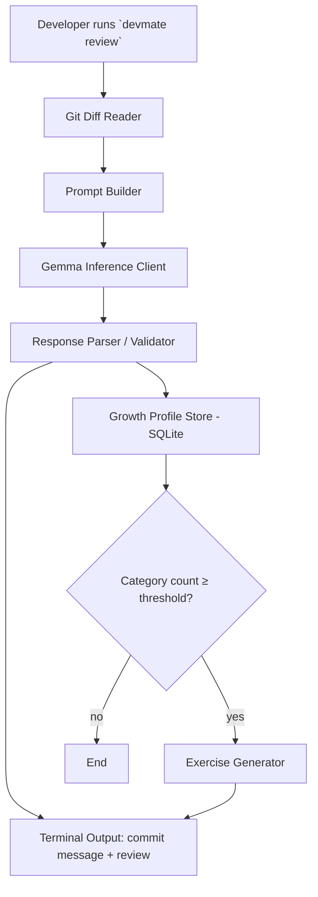

# DevMate

**A local-first developer assistant that reviews your code and coaches your growth over time.**

---

## 1. Project Name

**DevMate** — a privacy-first developer companion that automates routine Git chores and builds a personal coding-growth profile over time.

## 2. Problem Statement

Developers, especially students and early-career engineers, repeat the same mistakes across many commits (skipped error handling, missing tests, unclear commit messages) without a consistent feedback loop to catch the pattern. Existing AI coding assistants (GitHub Copilot, cloud code-review bots) either focus only on one-off suggestions or require sending proprietary code to a third-party cloud service, which is a blocker for students working on coursework under academic integrity policies, and for developers working on proprietary or sensitive codebases.

## 3. Project Overview

DevMate is a command-line developer assistant that inspects a developer's Git diff at commit time, generates a commit message and a structured code review, and — unlike existing tools — tracks recurring issue patterns in a persistent local growth profile. Once a pattern is detected, DevMate generates a short, targeted practice exercise aimed at that specific weakness. The long-term vision is a fully local-first tool (no code ever leaves the developer's machine), built around an open-weight model so it can eventually run entirely offline.

## 4. Proposed Solution

A CLI tool that wraps a lightweight, deterministic AI pipeline:
1. Capture the current Git diff.
2. Send it to an open-weight Gemma model with a structured prompt.
3. Parse the model's response into a commit message, a list of review issues (each tagged with a category), and explanations.
4. Store each issue occurrence in a local SQLite "growth profile" keyed by category.
5. When a category crosses a small threshold, generate a short practice exercise targeting that weakness.
6. Print a clear, readable summary to the terminal.

For the hackathon build, the model is called through a hosted inference endpoint serving an open-weight Gemma variant (for reliability during development and demo); the architecture is designed so this call can be swapped for a fully local Ollama-served model with no change to the rest of the pipeline, which is the intended production deployment.

## 5. Objectives

- Reduce the manual overhead of writing commit messages and doing first-pass code review.
- Give developers explanatory, not just corrective, feedback ("why", not just "what").
- Build a persistent record of a developer's recurring weak spots.
- Turn that record into small, targeted practice, rather than generic advice.
- Keep source code private by design, architected for local-first execution.

## 6. Target Users / Use Case

- **Students and early-career developers** who want feedback on their code without waiting for a human reviewer, and who benefit most from a persistent growth record.
- **Small dev teams and college project groups** who want consistent review quality without a dedicated senior reviewer always available.
- **Developers working on proprietary or sensitive codebases** who cannot send code to cloud-based AI review tools.

## 7. Open-Source AI Technology Selected

An **open-weight Gemma model** (the latest available Gemma generation at implementation time), accessed for the hackathon build via a hosted inference provider serving open-weight models, with local execution via Ollama as the designed end state.

## 8. Why This Technology Was Selected

- **Open weights**, which is a requirement of this challenge track and a prerequisite for the project's core privacy goal (eventually running entirely offline).
- **Strong code-reasoning capability** relative to its size, suited to reviewing diffs and generating structured output without requiring a much larger, heavier model.
- **Lightweight enough for local deployment** on a developer's own machine in the project's target end state, unlike larger open models that need substantial GPU resources.
- Appropriately licensed for redistribution and local self-hosting, which a closed, API-only model cannot offer.

## 9. AI's Role in the System

Gemma is the core reasoning engine, not an optional add-on. It performs three distinct tasks that the rest of the system depends on:
1. **Generation** — writing the commit message from the diff.
2. **Review and classification** — identifying issues in the diff, explaining them, and tagging each with a category (e.g. "missing-error-handling", "no-test-coverage").
3. **Exercise generation** — once a category recurs, producing a short, targeted practice problem.

Without the model, none of these three outputs can be produced; the surrounding code only stores, counts, and displays what the model returns.

## 10. System Architecture

## 11. Component-Level Architecture

| Component | Responsibility |
|---|---|
| CLI Entrypoint | Parses command (`devmate review`, `devmate profile`), orchestrates the pipeline |
| Git Diff Reader | Runs `git diff` via Node's `child_process`, returns diff text |
| Prompt Builder | Wraps the diff in a structured prompt requesting a fixed JSON schema |
| Gemma Inference Client | Sends the request to the hosted inference endpoint, handles retries on malformed output |
| Response Parser / Validator | Validates the returned JSON against the expected schema before use |
| Growth Profile Store | SQLite database (`better-sqlite3`); stores issue occurrences per category over time |
| Exercise Generator | Triggered when a category crosses a threshold; asks Gemma for one short, targeted exercise |
| Output Formatter | Prints commit message, review, and (if triggered) the exercise to the terminal |

## 12. Data / Information Flow

1. Developer stages changes and runs the CLI tool.
2. Raw diff text is extracted locally.
3. Diff + instructions are sent as a single prompt to the model.
4. Model returns structured JSON: `{ commit_message, issues: [{ description, category, severity }] }`.
5. Each issue's category is written to SQLite as one row with a timestamp.
6. A query counts occurrences per category; if a threshold is crossed, one more model call generates a practice exercise for that category.
7. All output is printed to the terminal; nothing leaves the developer's machine except the single inference request (during the hackathon demo; eliminated entirely once local Ollama execution is implemented).

## 13. Agentic Workflow (if applicable)

The hackathon MVP is a **deterministic, single-pass pipeline**, not an autonomous multi-step agent: each run makes at most two fixed model calls (review, and optionally one exercise). This is a deliberate scope decision for reliability within the hackathon timeframe. The planned next iteration introduces a true agentic loop (model decides which local tool to call next — re-run tests, re-check a specific file, etc.) using a lightweight Python agent framework, kept out of the MVP to avoid introducing a second new language and a harder reliability problem at the same time.

## 14. Technology Stack

- **Runtime:** Node.js (CLI tool)
- **Language:** JavaScript
- **Model access:** hosted inference API serving an open-weight Gemma model (e.g. Groq or OpenRouter), swappable for local Ollama
- **Storage:** SQLite via `better-sqlite3` (local file, zero setup)
- **Git integration:** Node's built-in `child_process` calling the system `git`
- **Output formatting:** plain console output (optionally `chalk` for readability)

## 15. Expected Features

**MVP (hackathon build):**
- Generate a commit message from the current diff
- Generate a structured code review with explanations, not just flags
- Categorize each issue and persist it to a local growth profile
- Auto-generate a short practice exercise once a category recurs past a threshold
- Print a simple growth summary (counts per category over time)

**Stretch (if time allows):**
- A minimal read-only dashboard (small web page) showing the growth profile visually

## 16. Implementation Approach

1. Scaffold the CLI and confirm `git diff` capture works end to end.
2. Build the prompt + inference call, test against real and synthetic diffs.
3. Add response validation (reject and retry once on malformed JSON).
4. Add the SQLite growth profile and the threshold-triggered exercise generator.
5. Seed the profile with a small set of realistic sample commits so the pattern-detection feature is demonstrable without needing days of real usage history.
6. Polish terminal output and prepare the demo script (run on DevMate's own repository).

All AI-assisted code is reviewed and understood by both team members before being used in the submission; no AI-generated code is included that either member cannot explain.

## 17. Expected Final Output

A working CLI tool that, run against a real Git diff, produces a commit message and an explained code review in seconds, persists issue patterns locally, and — once a pattern repeats — produces one targeted practice exercise. Demonstrated live against DevMate's own repository during development.

## 18. Future Scope / Scalability

- Full local-first execution via Ollama, removing the hosted-inference dependency entirely
- A true agentic tool-calling loop (re-running tests, checking specific files) rather than a fixed pipeline
- Packaging as both an **Agent Skill** (following the Agent Skill Open Standard) and an **MCP server**, so any compatible agent harness can use DevMate's review capability
- A lightweight web dashboard for visualizing growth over time
- Git hook integration for fully automatic review on every commit
- Support for team-wide aggregated growth analytics (opt-in, still local-first)

## 19. Open-Source Dependencies / Components

- Node.js
- `better-sqlite3`
- Git (system dependency)
- Open-weight Gemma model (via hosted inference for the hackathon build; Ollama for local deployment in future scope)

## 20. Expected Challenges and Mitigation

- **Limited prior AI/ML experience on the team.** Mitigated by choosing a deterministic single-pass pipeline over a true autonomous agent, and by using tooling (Node.js, SQLite) the team already knows well, isolating "new" risk to just the model-calling step.
- **The growth profile requires history to be meaningful.** Mitigated by seeding the demo with a small set of clearly-labeled realistic sample commits, since real multi-week usage data cannot be generated within the hackathon timeframe.
- **LLM output reliability (malformed or inconsistent JSON).** Mitigated with a strict schema in the prompt, response validation, and a single retry on failure.
- **Tight implementation timeframe.** Mitigated by aggressively scoping the MVP to one pipeline and three outputs, deferring packaging (Agent Skill/MCP) and local-first deployment to future scope rather than attempting them within the hackathon window.
